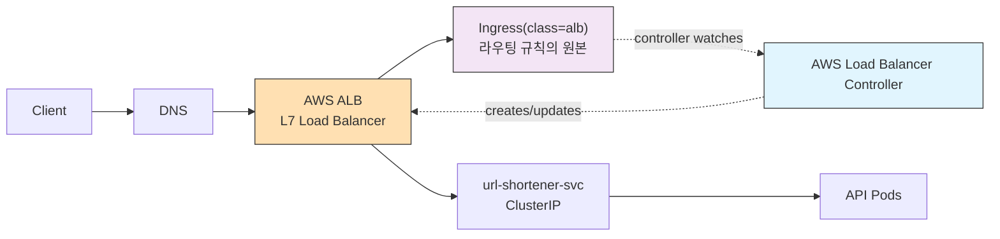
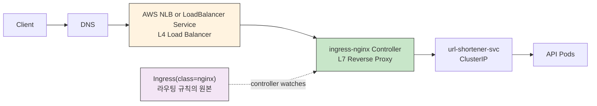
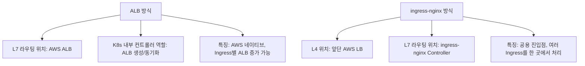
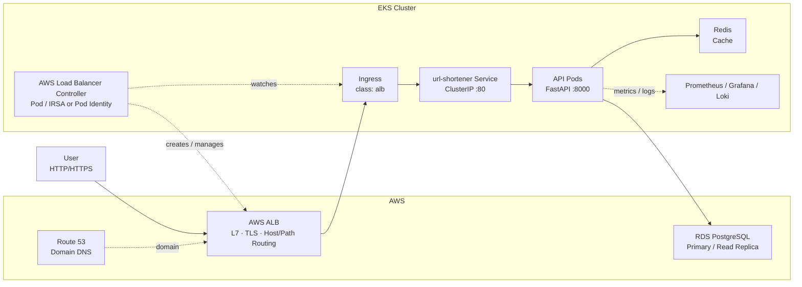
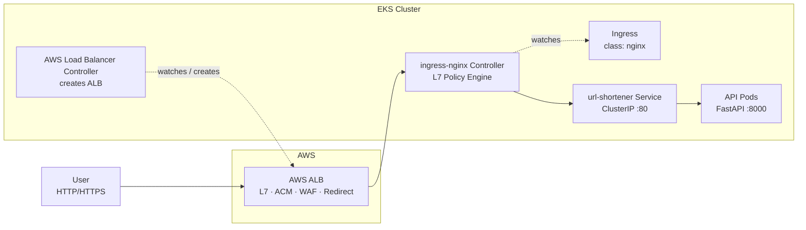
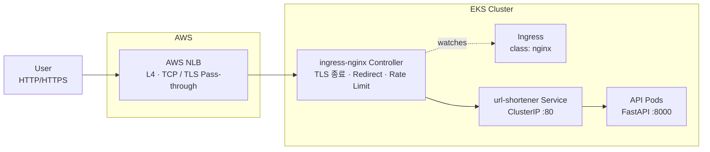

### ingress-nginx 적용 전, 후
![[Pasted image 20260430172525.png]]

![[Pasted image 20260430132404.png]]

이 프로젝트 기준으로 그리면, 핵심은 `어디에서 L7(HTTP/Host/Path) 라우팅을 하느냐`입니다. 지금 운영 설정은 `ALB`가 그 역할을 하고, `ingress-nginx`로 바꾸면 그 역할이 `nginx controller`로 내려옵니다.

**구조 비교**

적용 전, 현재 프로젝트의 운영 방향인 `ALB Controller` 방식입니다.

이 그림에서 봐야 할 포인트는:
1. `AWS Load Balancer Controller`는 트래픽을 직접 받지 않습니다.
2. 컨트롤러는 `Ingress(class=alb)`를 보고 AWS에 `ALB`를 생성/수정합니다.
3. 실제 L7 라우팅은 `ALB`가 합니다.
4. 그래서 “Ingress 리소스 -> AWS ALB 생성” 구조에 가깝습니다.

적용 후, `ingress-nginx Controller`를 쓰는 방식입니다.

여기서 포인트는:
1. 앞단 LB는 보통 `L4` 역할만 합니다.
2. `ingress-nginx Controller`가 실제 `L7` 라우팅을 합니다.
3. 즉 `Host`, `Path`, rewrite, custom nginx rule 같은 HTTP 레벨 제어가 NGINX 안에 모입니다.
4. 그래서 여러 앱 Ingress를 한 NGINX 진입점으로 묶기 쉬워집니다.

L4/L7만 따로 압축해서 보면 이렇게 이해하시면 됩니다.

**이 프로젝트에서 ALB 유지 vs ingress-nginx 전환**

이 프로젝트의 코드상 운영 경로는 ALB 쪽입니다. `values.prod.yaml`이 `className: alb`를 쓰고 있고, ALB 어노테이션도 이미 들어가 있습니다 [values.prod.yaml](/Users/jounghyeon/개발/Url-Shortener-EKS-Platform/url-shortener/url-shortener-chart/values.prod.yaml:31). 반면 기본값/로컬 예시는 `nginx` 기준입니다 [values.yaml](/Users/jounghyeon/개발/Url-Shortener-EKS-Platform/url-shortener/url-shortener-chart/values.yaml:41).

ALB를 유지할 때:
1. 지금 코드와 가장 잘 맞습니다. 이미 ALB Controller addon과 IRSA 코드가 있습니다.
2. AWS 관리형 L7을 쓰므로 운영 단순성이 좋습니다.
3. ACM, WAF, AWS 보안/네트워크 기능 연동이 자연스럽습니다.
4. 대신 앱이나 Ingress가 늘수록 ALB 수도 늘어나 비용과 관리 포인트가 커질 수 있습니다.
5. nginx rewrite, 세밀한 프록시 튜닝, 커스텀 NGINX 기능은 상대적으로 제한됩니다.

`ingress-nginx`로 전환할 때:
1. 여러 앱을 하나의 공용 진입점으로 묶기 쉬워 LB 비용 최적화에 유리할 수 있습니다.
2. path rewrite, header 제어, rate limit, nginx 설정 확장성이 좋습니다.
3. 대신 컨트롤러 자체를 우리가 운영해야 하므로 관리 대상이 하나 더 생깁니다.
4. 장애 지점이 `nginx controller`로 모이기 때문에 가용성/복제/업그레이드 전략을 더 신경 써야 합니다.
5. 현재 이 프로젝트의 prod 값, addon, 문서를 ALB 중심에서 nginx 중심으로 재정렬해야 합니다.

**프로젝트 관점 추천**

이 프로젝트가 지금처럼:
1. EKS 운영 학습/실습 성격이 강하고
2. AWS 연동을 보여주는 것이 중요하고
3. 앱 수가 많지 않다면

`ALB 유지`가 더 자연스럽습니다.

반대로:
1. 앞으로 여러 서비스를 한 클러스터에 계속 붙일 예정이고
2. 공용 ingress 한 곳으로 묶고 싶고
3. nginx 레벨의 세밀한 HTTP 제어가 필요하면

`ingress-nginx 전환`이 더 맞습니다.

한 줄로 요약하면:
`ALB`는 “AWS가 L7을 해주는 구조”, `ingress-nginx`는 “AWS LB는 앞단 L4만 하고, 클러스터 안의 NGINX가 L7을 하는 구조”입니다.

원하시면 다음 답변에서 이 프로젝트 기준으로
`실제로 어떤 파일을 어떻게 바꿔야 ingress-nginx 전환이 되는지`
변경 포인트만 체크리스트로 바로 정리해드리겠습니다.

---

현재 저장소 기준으로 보면 운영 경로는 `ALB Ingress(class: alb)` 중심이고, `url-shortener` 앱은 `Service -> API Pods -> Redis/RDS`로 이어지는 구조입니다. 아래 Mermaid는 그 기준으로 정리한 겁니다.

**현재 프로젝트 구조**

**구조안 1 — ALB → ingress-nginx**

이 구조는 `ACM`, `WAF`, `HTTP→HTTPS redirect`를 AWS 쪽에서 자연스럽게 처리하고, 실제 L7 세부 정책은 `ingress-nginx`가 담당하는 형태입니다.

**이 구조의 포인트**
- AWS ALB에서 `ACM`, `WAF`, `Listener redirect` 처리 가능
- `ingress-nginx`에서 `rate limit`, `allow-list`, `deny-list` 처리 가능
- 대신 계층이 하나 더 생겨서 구조가 조금 복잡해짐

---

**구조안 2 — NLB → ingress-nginx**

이 구조는 더 단순하고 `ingress-nginx` 중심 실습에 잘 맞습니다. 다만 `WAF` 같은 AWS L7 보안 기능은 자연스럽게 붙지 않습니다.

**이 구조의 포인트**
- `ingress-nginx`가 직접 TLS, redirect, rate limit을 처리
- 구조가 단순하고 학습용으로 명확함
- `WAF`, `ALB Listener Rule`, `ACM native L7 integration`은 약해짐

원하면 다음 단계로 바로 이어서
1. `week11` 문서에 넣기 좋은 스타일로 다듬은 Mermaid
2. 현재 구조 vs 변경 후 구조를 한 화면 비교용 Mermaid
3. `Redis/RDS/Monitoring`까지 포함한 풀 아키텍처 Mermaid

형태로 다시 정리해드릴게요.