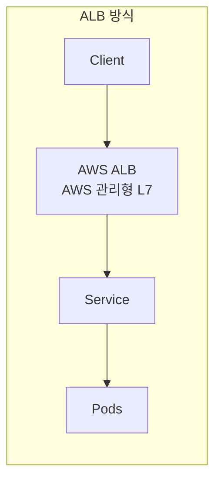
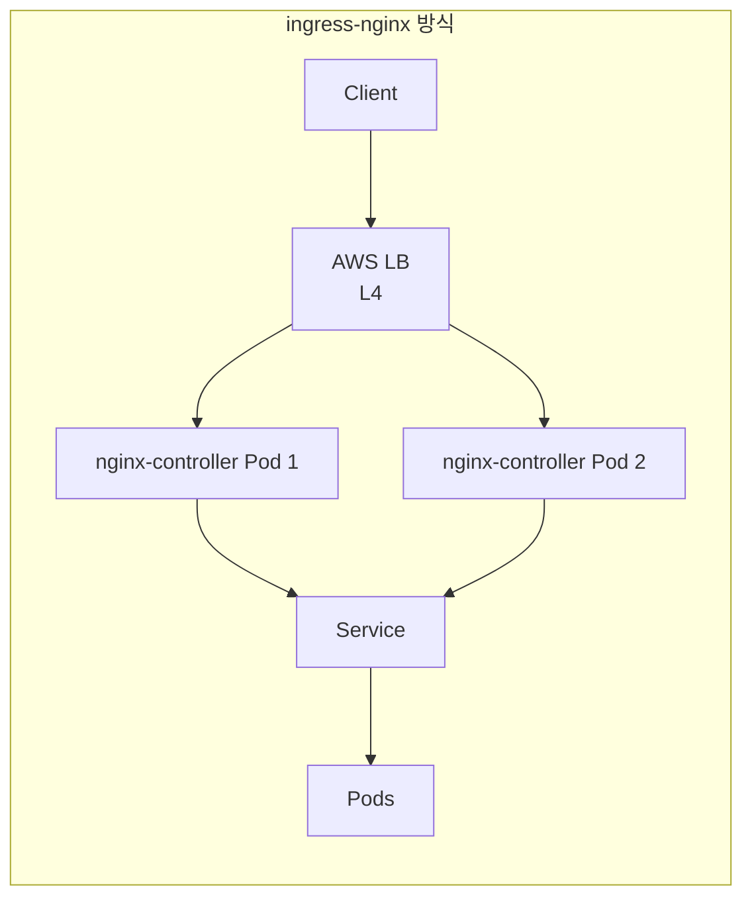

> [!note] Summary
> `ALB 방식`과 `ingress-nginx 방식`은 트래픽이 모이는 위치와 우리가 직접 책임지는 장애지점이 다릅니다.
>
> `ALB 방식`에서는 외부 요청이 먼저 `AWS ALB`로 들어오므로 트래픽 진입점은 ALB에 모입니다. 다만 ALB는 AWS가 운영하는 관리형 서비스이기 때문에, 우리가 직접 운영하는 장애지점이라고 보기는 어렵습니다. 이 방식에서 우리가 실제로 주의해야 할 부분은 `aws-load-balancer-controller`가 Ingress 변경을 ALB에 제대로 반영하지 못하는 경우, Ingress/annotation 설정 오류, 그리고 뒤쪽 `Service`나 `Pod` 장애입니다. 즉, 진입점은 ALB이지만 운영 책임이 강하게 집중되는 곳은 Kubernetes 설정과 애플리케이션 계층입니다.
>
> `ingress-nginx 방식`에서는 외부 요청이 앞단 AWS LB를 거친 뒤 클러스터 내부의 `nginx-controller Pod`로 전달됩니다. 이 `nginx-controller`가 실제 L7 라우팅을 수행하므로, 이 계층이 우리 운영 범위 안의 핵심 장애지점이 됩니다. Pod 하나의 장애는 replica로 완화할 수 있지만, 컨트롤러 배포 자체의 문제, 설정 오류, 업그레이드 실패, 과부하가 발생하면 여러 서비스가 동시에 영향을 받을 수 있습니다. 그래서 `ingress-nginx`는 제어권이 큰 대신 ingress 계층의 운영 책임도 우리에게 더 많이 옵니다.
>
> 정리하면, `ALB 방식`은 트래픽은 ALB로 모이지만 진입점 운영은 AWS가 맡고, `ingress-nginx 방식`은 트래픽과 L7 처리 책임이 `nginx-controller` 계층으로 모입니다. 따라서 `ALB 방식`은 운영 부담이 상대적으로 낮고, `ingress-nginx 방식`은 유연성이 큰 대신 직접 관리해야 할 장애지점이 더 뚜렷합니다.

---

완전히 같지는 않습니다. 둘 다 “진입점”이 있으니 앞단에 트래픽이 모인다는 의미는 있지만, 장애가 집중되는 위치가 다릅니다.

ALB 방식에서는 주된 데이터 플레인 진입점이 `AWS ALB`입니다. 그래서 외부 요청은 ALB로 모입니다. 다만 ALB 자체는 AWS 관리형이라 우리가 Pod처럼 직접 운영하지 않고, 멀티 AZ로 관리되는 서비스입니다. 그래서 보통 “장애지점이 ALB에 모인다”라고 아주 강하게 표현하기보다는, “외부 진입점은 ALB 하나지만 그 운영 책임은 AWS가 가진다”가 더 정확합니다. 이 방식에서 우리 쪽 장애 포인트는 오히려:
1. `aws-load-balancer-controller`가 Ingress 변경을 ALB에 반영하지 못하는 경우
2. 잘못된 Ingress/annotation 설정
3. backend Service/Pod 문제
쪽에 더 가깝습니다.

반면 `ingress-nginx` 방식에서는 실제 L7 프록시가 클러스터 내부의 `nginx controller pod`들입니다. 즉 요청이 최종적으로 반드시 그 컨트롤러들을 통과해야 하므로, 그 컨트롤러 레이어가 우리 운영 범위 안의 핵심 장애 포인트가 됩니다. 물론 replica를 2개 이상 두고 앞단 LB가 분산하면 “한 Pod 죽음 = 전체 장애”는 아니지만, `nginx controller` 배포 전체에 문제가 생기면 모든 Ingress가 같이 영향받습니다. 그래서 “장애지점이 nginx controller로 모인다”는 표현이 나오는 겁니다.

구조로 보면 이렇습니다.

여기서는 트래픽은 ALB로 모이지만, ALB 운영은 AWS 책임입니다.

여기서는 트래픽이 결국 `nginx-controller` 계층으로 모이고, 그 계층은 우리가 직접 운영합니다.

정리하면:
1. ALB 방식도 트래픽은 ALB로 모입니다.
2. 하지만 ALB는 AWS 관리형이라 우리가 직접 관리하는 장애지점 성격은 상대적으로 약합니다.
3. nginx 방식은 트래픽과 L7 처리 책임이 `nginx-controller`에 모이므로, 우리 쪽 운영 장애지점이 더 분명하게 생깁니다.

그래서 보통 실무에서는:
1. `ALB 방식`은 운영 부담이 적고 AWS 의존성이 높고
2. `nginx 방식`은 제어권이 크지만 우리가 책임질 컴포넌트가 늘어난다
로 이해하시면 가장 정확합니다.

